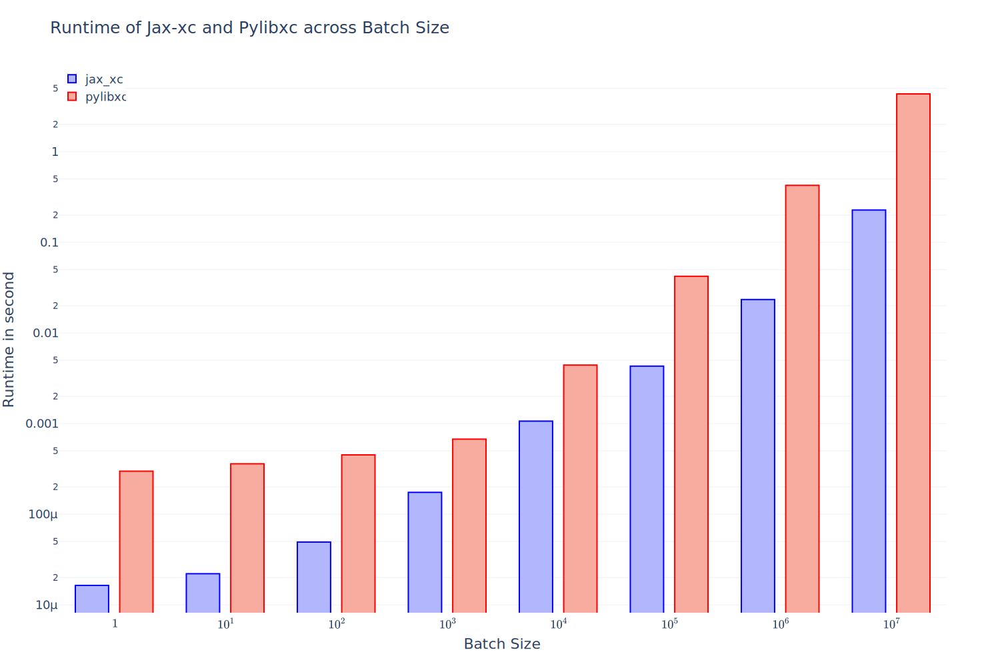

JAX Exchange Correlation Library
================================

This library contains direct translations of exchange correlation
functionals in `libxc <https://tddft.org/programs/libxc/>`__ to
`jax <https://github.com/google/jax>`__. The core calculations in libxc
are implemented in `maple <https://www.maplesoft.com/>`__. This gives us
the opportunity to translate them directly into python with the help of
`CodeGeneration <https://www.maplesoft.com/support/help/maple/view.aspx?path=CodeGeneration%2fPython>`__.

Usage
-----

Installation
~~~~~~~~~~~~

.. code:: sh

   pip install jax-xc

Invoking the Functionals
~~~~~~~~~~~~~~~~~~~~~~~~

jax_xc's API is functional: it receives $\\rho$ a function of ``Callable``
type, and returns the $\\varepsilon_{xc}$ as a function of ``Callable``
type.

.. code:: math

   E_{xc} = \int \rho(r) \varepsilon_{xc}(r) dr

LDA and GGA
^^^^^^^^^^^

Unlike ``libxc`` which takes pre-computed densities and their derivative
at certain coordinates. In ``jax_xc``, the API is designed to directly
take a density function.

.. code:: python

   import jax_xc

   def rho(r):
     """Electron number density.

     A function that takes a real coordinate, and returns a scalar
     indicating the number density of electron at coordinate r.

     Args:
       r: a 3D coordinate.
     Returns:
       rho: If it is unpolarized, it is a scalar.
            If it is polarized, it is a array of shape (2,).
     """
     pass

   exc = jax_xc.gga_xc_pbe1w(rho=rho, polarized=False)

   # Numerical integral with grids and their corresponding weights
   rho_times_exc = lambda w, r: w * rho(r) * exc(r)
   Exc = jnp.sum(vmap(rho_times_exc)(weights, grids))

mGGA
^^^^

Unlike LDA and GGA that only depends on the density function, mGGA
functionals also depend on the molecular orbitals.

.. code:: python

   import jax_xc

   def mo(r):
     """Molecular orbital.

     A function that takes a real coordinate, and returns the value of
     molecular orbital at this coordinate.

     Args:
       r: a 3D coordinate.
     Returns:
       mo: If it is unpolarized, it is a array of shape (N,).
           If it is polarized, it is a array of shape (N, 2).
     """
     pass

   exc = jax_xc.mgga_xc_cc06(rho=rho, polarized=polarized, mo=mo)

   # perform numerical integral like the example in LDA and GGA
   rho_times_exc = lambda w, r: w * rho(r) * exc(r)
   Exc = jnp.sum(vmap(rho_times_exc)(weights, grids))

Hybrid Functionals
^^^^^^^^^^^^^^^^^^

Hybrid functionals expose the same API, with extra attributes for the
users to access parameters needed outside of libxc/jax_xc (e.g. the
fraction of exact exchange).

.. code:: python

   import jax_xc

   def rho(r):
     """Electron number density.

     A function that takes a real coordinate, and returns a scalar
     indicating the number density of electron at coordinate r.

     Args:
       r: a 3D coordinate.
     Returns:
       rho: If it is unpolarized, it is a scalar.
            If it is polarized, it is a array of shape (2,).
     """
     pass

   exc = jax_xc.hyb_gga_xc_pbeb0(rho=rho, polarized=polarized)
   cam_alpha = exc.cam_alpha  # fraction of full Hartree-Fock exchange

The complete list of extra attributes can be found in the class below:

.. code:: python

   class HybridFunctional(Callable):
     cam_alpha: float
     cam_beta: float
     cam_omega: float
     nlc_b: float
     nlc_C: float

The meaning for each attribute is the same as libxc:

-  cam_alpha: fraction of full Hartree-Fock exchange, used both for
   usual hybrids as well as range-separated ones
-  cam_beta: fraction of short-range only(!) exchange in range-separated
   hybrids
-  cam_omega: range separation constant
-  nlc_b: non-local correlation, b parameter
-  nlc_C: non-local correlation, C parameter

Numerical Correctness
---------------------

We test all the functionals that are auto-generated from maple files
against the reference values in ``libxc``. The test is performed by
comparing the output of ``libxc`` and ``jax_xc`` and make sure they are
within a certain tolerance, namely ``atol=2e-10`` and ``rtol=2e-10``.

Performance Benchmark
---------------------

We report the performance benchmark of ``jax_xc`` against ``libxc`` on a
64-core machine with Intel(R) Xeon(R) Silver 4216 CPU @ 2.10GHz.

We sample the points to evaluate the functionals by varying the number
of points from 1 to $10^7$. The benchmark is performed by evaluating the
runtime of the functional. Note that the runtime of ``jax_xc`` is
measured by excluding the time of just-in-time compilation.

We visualize the mean value (reduced for both polarized and unpolarized)
of the runtime of ``jax_xc`` and ``libxc`` in the following figure. The
y-axis is log-scale.

We visualize the distribution of the runtime ratio of ``jax_xc`` and
``libxc`` in the following figure.

Note that, we exclude one datapoint ``mgga_x_2d_prhg07`` from the
runtime ratio visualization because it is an outlier due to Jax's lack
of support of\ ``lamberw`` function and we use
``tensorflow_probability.substrates.jax.math.lambertw``.

Caveates
--------

The following functionals from ``libxc`` are not available in ``jax_xc``
because some functions are not available in ``jax``.

.. code:: python

   gga_x_fd_lb94          # Becke-Roussel not having an closed-form expression
   gga_x_fd_revlb94       # Becke-Roussel not having an closed-form expression
   gga_x_gg99             # Becke-Roussel not having an closed-form expression
   gga_x_kgg99            # Becke-Roussel not having an closed-form expression
   hyb_gga_xc_case21      # Becke-Roussel not having an closed-form expression
   hyb_mgga_xc_b94_hyb    # Becke-Roussel not having an closed-form expression
   hyb_mgga_xc_br3p86     # Becke-Roussel not having an closed-form expression
   lda_x_1d_exponential   # Requires explicit 1D integration
   lda_x_1d_soft          # Requires explicit 1D integration
   mgga_c_b94             # Becke-Roussel not having an closed-form expression
   mgga_x_b00             # Becke-Roussel not having an closed-form expression
   mgga_x_bj06            # Becke-Roussel not having an closed-form expression
   mgga_x_br89            # Becke-Roussel not having an closed-form expression
   mgga_x_br89_1          # Becke-Roussel not having an closed-form expression
   mgga_x_mbr             # Becke-Roussel not having an closed-form expression
   mgga_x_mbrxc_bg        # Becke-Roussel not having an closed-form expression
   mgga_x_mbrxh_bg        # Becke-Roussel not having an closed-form expression
   mgga_x_mggac           # Becke-Roussel not having an closed-form expression
   mgga_x_rpp09           # Becke-Roussel not having an closed-form expression
   mgga_x_tb09            # Becke-Roussel not having an closed-form expression
   gga_x_wpbeh            # jit too long for E1_scaled
   gga_c_ft97             # jit too long for E1_scaled
   lda_xc_tih             # vxc functional
   gga_c_pbe_jrgx         # vxc functional
   gga_x_lb               # vxc functional

Building from Source Code
-------------------------

Modify the ``.env.example`` to fill in your envrionment variables, then
rename it to ``.env``. Then run ``source .env`` to load them into your
shell.

-  ``OUTPUT_USER_ROOT``: The path to the bazel cache. This is where the
   bazel cache will be stored. This is useful if you are building on a
   shared filesystem.

-  ``MAPLE_PATH``: The path to the maple binary.

-  ``TMP_INSTALL_PATH``: The path to a temporary directory where the
   wheel will be installed. This is useful if you are building on a
   shared filesystem.

How to build.

.. code:: sh

   bazel --output_user_root=$OUTPUT_USER_ROOT build --action_env=PATH=$PATH:$MAPLE_PATH @maple2jax//:jax_xc_wheel
